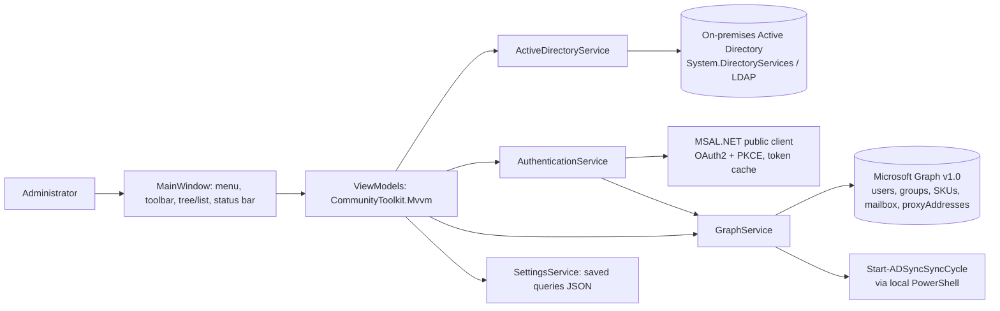

<div align="center">

# HybridAD-Manager

**A single pane of glass for managing Hybrid Active Directory and Microsoft Entra ID.**

A Windows WPF desktop application modeled after Active Directory Users & Computers, extended with cloud-native tabs for Microsoft 365 and Entra ID management.

[](https://dotnet.microsoft.com/)
[](https://learn.microsoft.com/dotnet/csharp/)
[](https://learn.microsoft.com/dotnet/desktop/wpf/)
[](#prerequisites)
[](#license)

[Features](#features) · [Quick start](#quick-start) · [Configuration](#configuration) · [Architecture](#architecture) · [Development](#development)

</div>

> ⚠️ **Work in progress — not production ready.** This project is under active development and has not been thoroughly tested in production environments. Features may be incomplete, unstable, or subject to breaking changes.

HybridAD-Manager ends the context-switching between ADUC (`dsa.msc`), the Microsoft 365 admin center, and the Exchange admin center. One console shows on-premises Active Directory objects alongside their Microsoft Entra ID cloud state — sync status, licenses, mailbox settings, and proxy addresses — with live correlation between the two directories.

## Features

| Area | What is included |
| --- | --- |
| Console shell | ADUC-style interface with menu bar, toolbar, domain/OU tree, details list with sorting and multi-select, context menus, status bar, and a custom XAML theme in the style of Windows 11 admin tools. |
| Active Directory | Domain discovery and OU tree walking via `System.DirectoryServices`; user, group, and computer retrieval; group membership management; enable, disable, delete, and move operations; LDAP-escaped global search by name, email, description, or phone. |
| Property sheets | 13-tab user property sheet: General, Address, Account, Profile, Telephones, Organization, Member Of, Dial-in, Environment, Hybrid Status, Licenses, Mailbox, and Email Addresses. |
| Microsoft Entra ID | MSAL.NET public-client authentication with OAuth2 + PKCE and MFA support, silent token refresh, and a platform-backed token cache (Windows DPAPI, with macOS Keychain and Linux Secret Service configuration in the cache helper). Microsoft Graph SDK v5 for all cloud operations. |
| Hybrid correlation | AD objects matched with Entra ID objects by UPN and immutable ID, with visual sync indicators for In Sync, Pending, Cloud-only, and Sync Error states. |
| Hybrid Status tab | Live sync state loaded lazily per object: Entra object ID, immutable ID, directory source, on-premises metadata (DN, domain, SAM, SID), and provisioning errors with error codes. |
| Force sync | Triggers an Azure AD Connect delta sync by invoking `Start-ADSyncSyncCycle -PolicyType Delta` through local PowerShell; requires the app to run on the Azure AD Connect server with the ADSync module installed. |
| Licenses tab | Visual SKU and service-plan grid for the signed-in tenant's subscribed SKUs, with assign/remove per user. |
| Mailbox tab | Auto-reply (automatic replies) editor, mail forwarding, and address-list visibility through the Graph mailbox settings API. |
| Email Addresses tab | `proxyAddresses` editor with validation and primary SMTP address management. |
| Find and saved queries | Global Find dialog (F3) with composable LDAP filters, plus saved queries persisted to JSON that surface in the tree under a Saved Queries node. |
| Bulk operations | Multi-select enable, disable, and delete from the list-view context menu, with confirmation dialogs. |
| CSV export | Export the current container or selected objects to CSV with full field coverage and proper escaping. |
| Keyboard and drag-and-drop | F5 refresh, F3 find, Ctrl+N new user, Ctrl+G new group, Ctrl+E export, Del delete; drag objects from the list onto tree OUs to move them, with target validation and confirmation. |
| Accessibility | 160 `AutomationProperties.Name` labels across the UI, tooltips on interactive elements, and a runtime high-contrast theme toggle in the View menu. |
| Resilience | Graceful fallback to built-in demo data (`contoso.com`) when no domain is reachable, global `DispatcherUnhandledException` handling, and a centralized dialog service for consistent messaging. |
| Packaging | MSIX manifest (`Package.appxmanifest`) with a single-file `win-x64` publish profile; image assets and publisher identity are placeholders awaiting real values. |

## Technology stack

| Layer | Technology |
| --- | --- |
| Framework | .NET 8, WPF (`net8.0-windows`), Windows-only |
| UI pattern | MVVM with `CommunityToolkit.Mvvm` 8.2.2 source generators |
| Dependency injection | `Microsoft.Extensions.DependencyInjection` 8.0.0 |
| AD connectivity | `System.DirectoryServices` 8.0.0 and `System.DirectoryServices.AccountManagement` 8.0.0 |
| Cloud API | `Microsoft.Graph` SDK 5.46.0 |
| Authentication | `Microsoft.Identity.Client` (MSAL.NET) 4.60.3 — OAuth2 + PKCE public client |
| Token cache | `Microsoft.Identity.Client.Extensions.Msal` 4.60.3 |
| Styling | Custom XAML resource dictionaries (colors, styles, data templates, high-contrast variant) |

## Quick start

### Prerequisites

- Windows 10 version 1809 (10.0.17763) or newer — Windows 11 recommended
- [.NET 8 SDK](https://dotnet.microsoft.com/download/dotnet/8.0) to build; the .NET 8 desktop runtime to run
- Optional: line-of-sight to an Active Directory domain controller (the app falls back to demo data without one)
- Optional: a Microsoft Entra ID app registration for cloud features (see [Configuration](#configuration))
- Optional: Visual Studio 2022 or newer for a designer-friendly development experience

### Build and run

```powershell
git clone https://github.com/tunwinlat/HybridAD-Manager.git
cd HybridAD-Manager
dotnet restore
dotnet build
dotnet run --project HybridADManager
```

On first launch the app attempts to discover the current domain. If no domain controller is reachable, it loads demo `contoso.com` data so the full UI can be explored without any infrastructure.

> **Note on the application icon:** `HybridADManager.csproj` references `Resources\app.ico`, which is intentionally not committed yet (see `HybridADManager/Resources/README.txt`). Add your own icon there — or temporarily remove the `<ApplicationIcon>` line — before building.

### Publish a single-file executable

```powershell
dotnet publish HybridADManager -c Release -r win-x64
```

The project is configured for `PublishSingleFile` with `SelfContained=false`, producing a single framework-dependent executable under `bin\Release\net8.0-windows\win-x64\publish`.

## Configuration

### Entra ID app registration

Cloud features (Hybrid Status, Licenses, Mailbox, Email Addresses, Force Sync) require signing in to Microsoft Graph. Register an application first:

1. Open the [Azure portal](https://portal.azure.com) → **Microsoft Entra ID** → **App registrations** → **New registration**.
2. Name it `HybridAD-Manager`.
3. Supported account types: **Accounts in this organizational directory only**.
4. Redirect URI: platform **Public client/native (mobile & desktop)** → `http://localhost`.
5. Register, then copy the **Application (client) ID**.
6. Under **API permissions**, add the Microsoft Graph **delegated** permissions:
   - `User.Read.All`
   - `Group.Read.All`
   - `Directory.Read.All`
   - `Organization.Read.All`
7. Click **Grant admin consent**.

Then set the client ID in `HybridADManager/Services/IAuthenticationService.cs`:

```csharp
public class AuthenticationSettings
{
    public string ClientId { get; set; } = "your-application-client-id-here";
    public string TenantId { get; set; } = "common";   // or your tenant ID / domain
    // ...
}
```

> **Note:** The repository ships with the public **Microsoft Graph Explorer** client ID as a convenience placeholder so the sign-in flow can be tried immediately. It is not affiliated with this project — register and use your own app for any real tenant.

No other configuration files, secrets, or connection strings exist in the repository. Saved queries and the MSAL token cache live under `%LocalAppData%\HybridADManager` at runtime and are never committed.

### Force sync prerequisites

The Force Sync button runs `Start-ADSyncSyncCycle -PolicyType Delta` via local PowerShell. It only succeeds when the app is executed on the Azure AD Connect server with the ADSync PowerShell module installed; otherwise it surfaces an explanatory error.

## Architecture



### Data flow

1. `DirectoryTreeViewModel` loads the domain/OU tree from AD, falling back to demo data when no domain is reachable.
2. `ObjectListViewModel` loads the objects of the selected node and, when signed in, correlates each object with Microsoft Graph by UPN to populate cloud metadata and sync indicators.
3. Opening an object shows the 13-tab property sheet; the Hybrid Status tab loads live sync state lazily on first open.
4. Cloud mutations (license assignment, mailbox settings, proxy addresses) go through `GraphService`; directory mutations (enable/disable/delete/move) go through `ActiveDirectoryService`.

### Repository layout

```text
HybridAD-Manager/
├── HybridADManager.sln                # Visual Studio solution
├── HybridADManager/
│   ├── App.xaml / App.xaml.cs         # Entry point, DI container, global exception handling
│   ├── MainWindow.xaml                # Shell: menu, toolbar, tree/list split, status bar
│   ├── Package.appxmanifest           # MSIX packaging manifest (placeholder assets)
│   ├── Models/                        # DirectoryObject, HybridUser/Group/Computer, SyncStatus, SavedQuery
│   ├── Services/                      # AD, MSAL auth, Graph, settings, and dialog services (+ interfaces)
│   ├── ViewModels/                    # Main window, tree, list, find/saved-query dialogs, property-sheet tabs
│   ├── Views/                         # Tree, list, property sheets (13 tabs), dialogs
│   └── Infrastructure/
│       ├── Converters/                # Value converters (visibility, icons, sync-status brushes)
│       ├── Helpers/                   # CSV export helper
│       └── Themes/                    # ADUC-style colors, styles, templates, high-contrast theme
├── plan.md                            # Original development plan
└── AGENTS.md                          # Guide for AI coding agents working on this repo
```

## Development

| Command | Purpose |
| --- | --- |
| `dotnet restore` | Restore NuGet packages. |
| `dotnet build` | Build the solution (Debug). |
| `dotnet run --project HybridADManager` | Build and launch the app. |
| `dotnet publish HybridADManager -c Release -r win-x64` | Produce a single-file framework-dependent executable. |

The codebase uses nullable reference types and implicit usings, MVVM source generators (`[ObservableProperty]`, `[RelayCommand]`), and constructor-injected services registered in `App.xaml.cs`. All UI text, comments, and documentation are in English.

## Security

- No credentials, secrets, or tenant identifiers are stored in code or configuration files.
- Authentication uses the OAuth2 public-client flow with PKCE; MFA is supported through the Microsoft identity platform.
- Tokens are cached through the MSAL extension cache with platform protection (Windows DPAPI).
- Cloud operations run under the signed-in administrator's own delegated permissions, so every action is attributable in the Entra ID audit logs.

## Screenshots

*Coming soon.*

## Contributing

This project is in early development. Feedback, bug reports, and pull requests are welcome.

1. Fork the repository and create a focused branch.
2. Verify `dotnet build` succeeds and exercise the change against either a test domain or the built-in demo data.
3. Open a pull request describing the motivation and the verification performed.

## License

No license has been chosen for this project yet. Until one is added, the code is public for viewing but all rights are reserved by the author. If you would like to use or build on it, please open an issue.

## Acknowledgments

Inspired by the familiar experience of **Active Directory Users & Computers** and tools like **Easy365Manager**.
